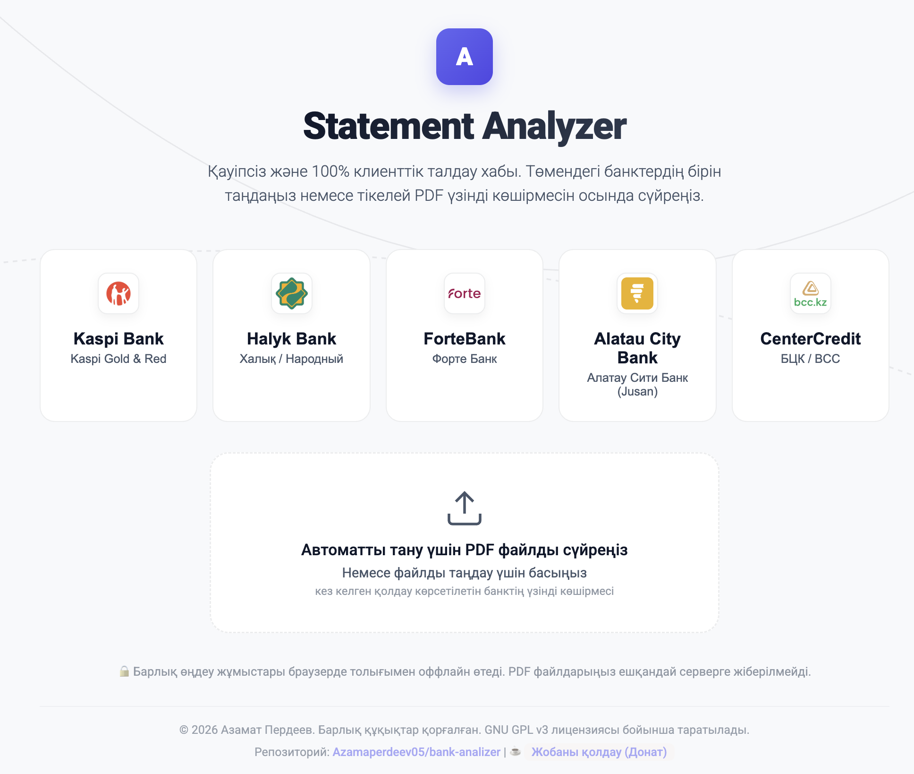
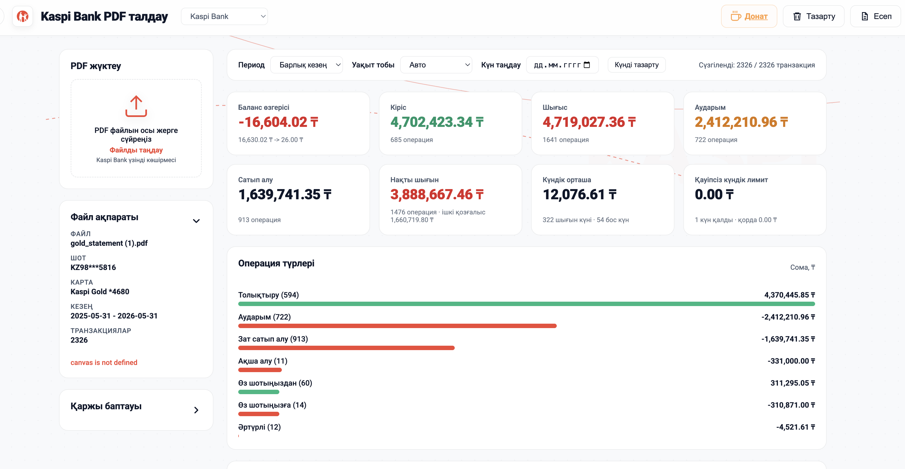

# 📊 Қазақстан банктерінің PDF үзінді көшірмелерін талдау орталығы

Автор: **Азамат Пердеев**
Репозиторий: [https://github.com/Azamaperdeev05/bank-analizer](https://github.com/Azamaperdeev05/bank-analizer)
Қолдау көрсету (Донат): [https://donat-woad.vercel.app/](https://donat-woad.vercel.app/)

Бұл қосымша — қазақстандық жетекші бес банктің PDF үзінді көшірмелерін (statement) талдауға, шығындар мен кірістерді бақылауға арналған қауіпсіз, заманауи және **100% локальді (клиенттік)** веб-платформа.

Жоба толықтай браузер ішінде өтетін қаржылық талдауды қамтамасыз етеді.

---

## ☕ Жобаны қолдау (Донат)

Егер бұл анализатор сіздің уақытыңызды үнемдеп, қаржыңызды реттеуге көмектессе, жобаның одан әрі дамуына үлес қосып, әзірлеушіге донат жібере аласыз! Сіздің қолдауыңыз жаңа банктік алгоритмдерді қосуға және жаңа аналитикалық панельдерді енгізуге үлкен демеу болады.

👉 **Донат жіберу мекенжайы:** [https://donat-woad.vercel.app/](https://donat-woad.vercel.app/)

---


## 🏛️ Қолдау көрсетілетін банктер

Анализатор келесі банктердің үзінді көшірмелерін толықтай таниды және өңдейді:
1. **Kaspi Bank** (Kaspi Gold және Kaspi Red үзінді көшірмелері)
2. **Halyk Bank** (Халық / Народный Банк)
3. **ForteBank**
4. **Jusan Bank**
5. **Bank CenterCredit** (БЦК / ЦентрКредит)

---

## 🌟 Басты мүмкіндіктері

* **Банк таңдау терезесі (Splash Cover):** Сайтқа кіргенде пайдаланушы өзіне ыңғайлы банкті таңдайды. Таңдалған сәтте веб-интерфейстің бүкіл түсі мен брендинг элементтері (логотип, неонды жарықтар, су таңбалары және градиенттер) сол банктің ресми стиліне лезде өзгереді.
* **Автоматты тану (Zero-Click Auto-Detection):** PDF файлын таңдау парақшасына жай ғана сүйреп әкелсеңіз, жүйе оны автоматты түрде оқып, қай банк екенін анықтайды, сәйкес бренд дизайнын қолданады және талдауды бірден бастайды!
* **Аналитикалық панель:**
  * **HTML5 Canvas графиктері:** Кірістер, шығындар мен таза баланстың динамикасын көрсететін интерактивті желілік диаграмма.
  * **Күнтізбелік жылу картасы (Heatmap Calendar):** Шығындардың күнделікті белсенділігін ыңғайлы түрде визуализациялау.
  * **Бюджет лимиттері мен мақсаттар:** Санаттар бойынша айлық шығын лимиттерін қою және қаржылық мақсаттарды бақылау.
  * **50/30/20 ережесі:** Айлық кірісті мұқтаждықтарға (50%), қалауларға (30%) және жинақтарға (20%) автоматты түрде бөлу.
  * **Қайталанатын және ірі төлемдерді талдау:** Ай сайынғы тұрақты шығындар мен орнатылған шектен асатын ірі транзакцияларды автоматты топтау.
* **Сүзгілеу және іздеу жүйесі:** Периодтар, шығын түрлері, таңдалған күндер және кілт сөздер бойынша лезде сүзгілеу.
* **Деректерді экспорттау:** Сүзілген транзакцияларды бір батырмамен **CSV**, **JSON** немесе **HTML есеп** форматтарында жүктеп алу.

---

## 🔒 Қауіпсіздік және Құпиялылық кепілдігі

Біз сіздің қаржылық деректеріңіздің құпиялылығына 100% кепілдік береміз:
* **Локальді өңдеу:** PDF файлдары ешқандай серверге жіберілмейді. Барлық талдау және мәтінді оқу жұмыстары Mozilla-ның `PDF.js` кітапханасы арқылы тікелей сіздің құрылғыңызда (браузер жадында) орындалады.
* **Желілік трафиксіз:** Деректерді талдау кезінде сыртқы API немесе серверлермен байланыс орнатылмайды.
* **Сессиялық өмірлік цикл:** Браузер парақшасын жаңартқан немесе жапқан сәтте барлық оқылған транзакциялар құрылғы жадынан біржола өшіріледі.

---

## 💻 Локальді іске қосу

Жобаны ешқандай сыртқы кітапханаларсыз немесе күрделі орнатусыз өз компьютеріңізде іске қосуға болады:

1. Репозиторийді жүктеп алыңыз немесе клондаңыз:
   ```bash
   git clone https://github.com/Azamaperdeev05/bank-analizer.git
   cd bank-analizer
   ```

2. Локальді статикалық веб-серверді қосыңыз:
   ```bash
   # Python 3 арқылы
   python3 -m http.server 8080
   ```

3. Браузеріңізді ашып, **`http://localhost:8080`** сілтемесіне өтіңіз.

---

## 🚀 Өндіріске орналастыру (Vercel)

Бұл жоба толықтай статикалық болғандықтан, оны **Vercel** статикалық хостингінде оңай жариялауға болады:
1. `tools/` папкасын Vercel жобаңызға қосыңыз.
2. Келесі параметрлерді орнатыңыз:
   * **Framework Preset:** Other / None (Static Site)
   * **Build Command:** *Бос қалдырыңыз*
   * **Output Directory:** `.`
3. Порталға енгізілген [`vercel.json`](./vercel.json) файлы Vercel-де қауіпсіздік тақырыпшаларын (MIME types, X-Frame-Options, X-Content-Type-Options) автоматты түрде баптайды.

---

## 📜 Лицензия (GNU GPL v3)

Бұл жоба **GNU General Public License v3 (GPL v3)** лицензиясы бойынша таратылады. Бұл сізге келесі құқықтарды береді:
* Бағдарламалық жасақтаманы кез келген мақсатта шектеусіз іске қосу және пайдалану.
* Бағдарламаның бастапқы кодын оқу, зерттеу және өз қажеттіліктеріңізге қарай өзгерту.
* Бағдарламаның өзгертілген немесе өзгертілмеген көшірмелерін басқаларға тарату.

Лицензияның толық шарттары мен мәтінін [`LICENSE`](./LICENSE) файлынан оқи аласыз.

---

> 💬 **“Talk is cheap. Show me the code.”** — *Linus Torvalds*
> *(Open-source вариациясы: **“Talk is cheap, send patches.”**)*
> 
> Бұл жоба open-source қауымдастығының қағидаларына сүйенеді. Егер сізде жобаны жақсарту, жаңа банк алгоритмдерін қосу немесе қателерді түзету бойынша идеялар болса, жай ғана сөйлей бермей, нақты код немесе Pull Request (патч) жіберуіңізге әрқашан қуаныштымыз! 🤝

*Сізге сәтті қаржылық талдау тілейміз!*
